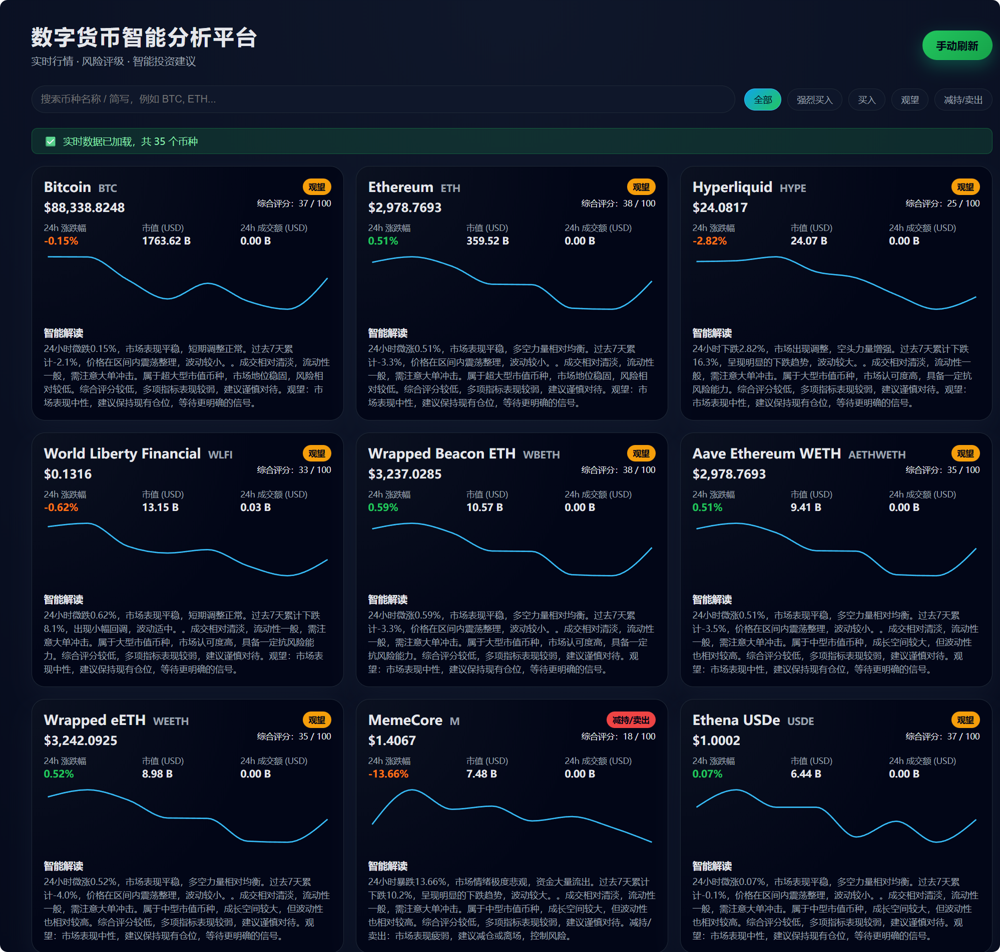
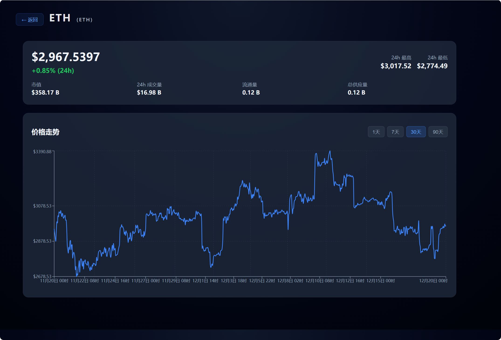

# 🚀 数字货币智能分析平台

<div align="center">


**专业的实时加密货币市场分析与投资决策平台**

[功能特性](#-核心功能) • [快速开始](#-快速开始) • [部署指南](#-部署指南) • [API文档](#-api接口文档)

</div>

## 📸 项目预览

### 实时市场概览


### 币种详情与K线分析


---

## 📋 目录

- [项目简介](#-项目简介)
- [核心功能](#-核心功能)
- [技术架构](#-技术架构)
- [项目结构](#-项目结构)
- [快速开始](#-快速开始)
- [部署指南](#-部署指南)
- [API接口文档](#-api接口文档)
- [配置说明](#-配置说明)
- [功能亮点](#-功能亮点)
- [未来展望](#-未来展望)
- [常见问题](#-常见问题)
- [贡献指南](#-贡献指南)

---

## 🎯 项目简介

**数字货币智能分析平台**是一个企业级的加密货币市场分析系统，提供实时行情数据、智能投资建议、多维度风险评估和专业的K线图表分析。平台采用多数据源聚合技术，确保数据的高可用性和实时性，为投资者提供专业、可靠的市场洞察。

### 核心价值

- ✅ **实时数据**：多API源聚合，2分钟自动刷新，确保数据时效性
- ✅ **智能分析**：基于多维度指标（趋势、流动性、市值、波动率）的智能推荐算法
- ✅ **专业体验**：精美的UI设计，流畅的交互体验，响应式布局
- ✅ **高可用性**：多级容错机制，智能缓存策略，确保服务稳定
- ✅ **一键部署**：支持本地部署和云端部署（Vercel），开箱即用

---

## ✨ 核心功能

### 📊 市场概览
- **实时行情展示**：50+主流加密货币的实时价格、涨跌幅、市值、成交量
- **智能筛选**：按投资建议（强烈买入/买入/观望/卖出）快速筛选
- **实时搜索**：支持币种名称和代码快速搜索
- **走势图表**：7日价格走势迷你图，直观展示价格趋势

### 🎯 智能分析
- **多维度评分**：综合流动性、动量、趋势、市值稳定性等指标
- **智能推荐**：基于市场数据的动态投资建议（非固定标签）
- **智能解读**：AI驱动的市场分析文本，解读价格走势和投资机会
- **风险评估**：自动评估币种风险等级

### 📈 详情分析
- **K线图表**：30天历史价格走势，支持1天/7天/30天/90天视图
- **详细指标**：24h最高/最低价、市值、成交量、流通量等
- **深度分析**：币种描述、社区数据、开发者数据
- **交互体验**：点击卡片即可跳转详情页，流畅的页面切换

### 🔄 数据管理
- **智能缓存**：2分钟缓存机制，减少API调用，提升响应速度
- **多源聚合**：优先使用CryptoCompare和CoinMarketCap，自动降级到其他数据源
- **容错机制**：API失败时自动切换数据源，确保服务可用
- **离线支持**：本地数据备份，网络异常时仍可显示数据

---

## 🏗️ 技术架构

### 前端技术栈
- **框架**：React 18.3 + TypeScript 5.6
- **构建工具**：Vite 6.0（极速构建）
- **路由**：React Router DOM 6.26（SPA路由）
- **图表库**：Recharts 2.13（专业图表组件）
- **HTTP客户端**：Axios 1.7（请求拦截与错误处理）

### 后端技术栈
- **运行时**：Node.js + Express 4.21
- **语言**：TypeScript 5.6（类型安全）
- **数据源**：
  - CryptoCompare API（优先，有API密钥）
  - CoinMarketCap API（次优，有API密钥）
  - CoinGecko API（备用）
  - CoinCap API（备用）
  - Binance API（备用）

### 部署架构
- **前端**：Vercel Static Build（静态站点）
- **后端**：Vercel Serverless Functions（无服务器函数）
- **构建**：TypeScript编译 + Vite打包

---

## 📁 项目结构

```
crypto-intel-platform/
├── client/                 # 前端应用
│   ├── src/
│   │   ├── modules/
│   │   │   ├── App.tsx          # 主应用组件（市场概览）
│   │   │   └── CoinDetail.tsx   # 币种详情页组件
│   │   ├── main.tsx             # 应用入口（路由配置）
│   │   └── styles.css           # 全局样式
│   ├── dist/                    # 构建输出
│   ├── package.json
│   └── vite.config.ts           # Vite配置
│
├── server/                 # 后端服务
│   ├── src/
│   │   ├── index.ts             # Express服务器入口
│   │   └── services/
│   │       └── marketService.ts # 市场数据服务（多API源聚合）
│   ├── data/
│   │   └── coins-backup.json    # 本地数据备份
│   ├── scripts/
│   │   └── update-local-data.js # 数据更新脚本
│   ├── dist/                    # TypeScript编译输出
│   └── package.json
│
├── api/                    # Vercel Serverless Functions
│   └── index.js            # API路由处理
│
├── vercel.json             # Vercel部署配置
├── package.json            # 根目录配置（Monorepo）
└── README.md              # 项目文档
```

---

## 🚀 快速开始

### 环境要求

- **Node.js** >= 16.0.0
- **npm** >= 8.0.0 或 **yarn** >= 1.22.0

### 安装步骤

1. **克隆项目**
   ```bash
   git clone <repository-url>
   cd crypto-intel-platform
   ```

2. **安装依赖**
   ```bash
   npm install
   ```
   这会自动安装前端和后端的所有依赖。

3. **配置API密钥（可选）**
   
   在 `server/src/services/marketService.ts` 中已配置默认API密钥：
   - CryptoCompare API Key: `32a4a0ad3f972271ffdfc992ba2a63b0a9fa9e17558836cb6dff452f187233cb`
   - CoinMarketCap API Key: `931662f2eaa4447685061867557d06e6`
   
   如需使用自己的API密钥，请修改相应配置。

4. **启动开发服务器**
   ```bash
   npm run dev
   ```
   
   这将同时启动：
   - 后端服务器：http://localhost:4000
   - 前端开发服务器：http://localhost:5173

5. **访问应用**
   
   打开浏览器访问：http://localhost:5173

### 开发命令

```bash
# 开发模式（前后端同时启动）
npm run dev

# 构建生产版本
npm run build

# 启动生产服务器
npm start

# 更新本地数据备份
cd server && npm run update-data
```

---

## 📦 部署指南

### 方式一：本地部署

#### Windows 一键启动

双击运行 `start-all.bat` 文件，自动启动前后端服务。

#### 手动启动

```bash
# 1. 构建项目
npm run build

# 2. 启动后端服务器
cd server
npm start

# 3. 启动前端（新终端）
cd client
npm run preview
```

### 方式二：Vercel 云端部署

#### 前置准备

1. 安装 Vercel CLI
   ```bash
   npm i -g vercel
   ```

2. 登录 Vercel
   ```bash
   vercel login
   ```

#### 部署步骤

1. **部署到预览环境**
   ```bash
   vercel
   ```

2. **部署到生产环境**
   ```bash
   vercel --prod
   ```

3. **配置环境变量（可选）**
   
   在 Vercel 项目设置中添加：
   - `CRYPTOCOMPARE_API_KEY`：CryptoCompare API密钥
   - `COINMARKETCAP_API_KEY`：CoinMarketCap API密钥
   - `NODE_ENV`：production

#### 部署后访问

部署成功后，Vercel 会提供：
- 预览URL：`https://your-project-xxx.vercel.app`
- 生产URL：`https://your-project.vercel.app`

### 方式三：Docker 部署（可选）

```dockerfile
# Dockerfile 示例
FROM node:18-alpine
WORKDIR /app
COPY package*.json ./
RUN npm install
COPY . .
RUN npm run build
EXPOSE 4000
CMD ["npm", "start"]
```

---

## 📡 API接口文档

### 基础URL

- **本地开发**：`http://localhost:4000`
- **Vercel部署**：`https://your-domain.vercel.app`

### 接口列表

#### 1. 获取市场概览

```http
GET /api/overview
```

**查询参数：**
- `force` (可选): `true` - 强制刷新，清除缓存

**响应示例：**
```json
[
  {
    "id": "bitcoin",
    "symbol": "btc",
    "name": "Bitcoin",
    "current_price": 43250.50,
    "price_change_percentage_24h": 2.45,
    "market_cap": 850000000000,
    "total_volume": 25000000000,
    "sparkline_in_7d": {
      "price": [42000, 42500, 43000, ...]
    },
    "score": 0.85,
    "recommendation": "strong_buy",
    "insight": "24小时上涨2.45%，市场表现稳健..."
  }
]
```

#### 2. 获取币种详情

```http
GET /api/coins/:id
```

**路径参数：**
- `id`: 币种ID或symbol（如：`bitcoin`, `btc`, `ethereum`）

**响应示例：**
```json
{
  "id": "bitcoin",
  "symbol": "BTC",
  "name": "Bitcoin",
  "description": "Bitcoin is a decentralized digital currency...",
  "market_data": {
    "current_price": { "usd": 43250.50 },
    "market_cap": { "usd": 850000000000 },
    "price_change_percentage_24h": 2.45,
    "high_24h": { "usd": 44000 },
    "low_24h": { "usd": 42500 }
  },
  "prices": [[1704067200000, 43000], ...],
  "volumes": [[1704067200000, 25000000000], ...]
}
```

#### 3. 健康检查

```http
GET /api/health
```

**响应：**
```json
{
  "status": "ok",
  "timestamp": "2024-01-01T00:00:00.000Z",
  "message": "API服务正常运行"
}
```

#### 4. API诊断

```http
GET /api/diagnose
```

**响应：**
```json
{
  "timestamp": "2024-01-01T00:00:00.000Z",
  "tests": [
    {
      "name": "CoinGecko",
      "status": "success",
      "duration": "150ms",
      "message": "连接正常"
    }
  ]
}
```

---

## ⚙️ 配置说明

### API数据源优先级

平台采用多级容错机制，按以下顺序尝试获取数据：

1. **CryptoCompare API**（优先）
   - API密钥：`32a4a0ad3f972271ffdfc992ba2a63b0a9fa9e17558836cb6dff452f187233cb`
   - 特点：数据质量高，响应速度快

2. **CoinMarketCap API**（次优）
   - API密钥：`931662f2eaa4447685061867557d06e6`
   - 特点：数据全面，市场覆盖广

3. **CoinGecko API**（备用）
   - 特点：免费，数据完整，但可能有速率限制

4. **CoinCap API**（备用）
   - 特点：免费，轻量级

5. **Binance API**（备用）
   - 特点：交易所数据，实时性强

6. **本地数据文件**（`server/data/coins-backup.json`）
   - 特点：离线可用，需要手动更新

7. **模拟数据**（最后备用）
   - 特点：确保系统始终可用

### 缓存策略

- **缓存时长**：2分钟
- **缓存位置**：浏览器 localStorage
- **刷新机制**：
  - 自动刷新：每2分钟静默刷新
  - 手动刷新：2分钟内有缓存则使用缓存，否则强制刷新
  - 首次加载：先显示缓存，后台获取最新数据

### 智能推荐算法

推荐标签基于以下多维度分析：

- **流动性分数**（30%权重）：成交量/市值比率
- **动量分数**（25%权重）：24小时涨跌幅
- **趋势分数**（25%权重）：7日价格走势分析
- **市值稳定性**（20%权重）：市值规模评估

**推荐规则：**
- **强烈买入**：综合评分 > 0.75 + 24h涨幅 > 5% + 强烈上涨趋势
- **买入**：综合评分 > 0.6 + 24h涨幅 > 2% + 上涨趋势
- **观望**：其他情况（包括异常波动 > 15%）
- **卖出**：综合评分 < 0.3 + 24h跌幅 < -5% + 强烈下跌趋势

---

## 🌟 功能亮点

### 1. 智能数据聚合
- 多API源自动切换，确保数据可用性
- 智能缓存机制，减少API调用
- 数据格式统一，前端无需适配

### 2. 实时性能优化
- 首次加载立即显示缓存数据
- 后台静默更新，用户体验流畅
- 2分钟自动刷新，数据时效性强

### 3. 专业UI设计
- 深色主题，护眼舒适
- 响应式布局，适配各种设备
- 流畅动画，交互体验优秀

### 4. 智能分析引擎
- 多维度评分算法
- 动态推荐标签（非固定）
- AI驱动的市场解读

### 5. 高可用性保障
- 多级容错机制
- 自动降级策略
- 离线数据支持

---

## 🔮 未来展望

### 短期规划（1-3个月）

- [ ] **用户系统**
  - 用户注册/登录
  - 个人投资组合管理
  - 收藏币种功能
  - 价格提醒设置

- [ ] **高级图表**
  - 专业K线图（蜡烛图）
  - 技术指标（MA、MACD、RSI等）
  - 多时间周期切换
  - 图表标注工具

- [ ] **数据分析增强**
  - 历史回测功能
  - 相关性分析
  - 市场情绪指标
  - 资金流向分析

- [ ] **通知系统**
  - 价格预警推送
  - 重大事件通知
  - 投资建议更新提醒

### 中期规划（3-6个月）

- [ ] **移动端应用**
  - React Native移动应用
  - 推送通知支持
  - 离线数据查看

- [ ] **社交功能**
  - 社区讨论区
  - 专家观点分享
  - 投资策略交流

- [ ] **AI增强**
  - 机器学习价格预测
  - 智能投资组合推荐
  - 自然语言市场分析

- [ ] **多语言支持**
  - 国际化（i18n）
  - 多语言界面
  - 多地区数据源

### 长期愿景（6-12个月）

- [ ] **DeFi集成**
  - DeFi协议数据
  - 流动性挖矿分析
  - 收益计算器

- [ ] **交易功能**
  - 模拟交易
  - 实盘交易接口
  - 策略回测平台

- [ ] **企业版功能**
  - 多用户管理
  - 数据导出
  - API访问控制
  - 自定义分析指标

- [ ] **区块链数据**
  - 链上数据分析
  - 大额转账监控
  - 钱包地址追踪

---

## ❓ 常见问题

### Q1: 为什么有些币种显示"观望"？

A: 推荐标签是基于实时市场数据动态计算的。如果币种显示"观望"，可能是因为：
- 市场表现中性，无明显趋势
- 波动率过高，风险较大
- 24小时涨跌幅在正常范围内

### Q2: 数据更新频率是多少？

A: 
- **自动刷新**：每2分钟自动更新一次
- **手动刷新**：点击"手动刷新"按钮立即更新
- **缓存机制**：2分钟内的数据使用缓存，无需等待

### Q3: 如何更新本地数据备份？

A: 运行以下命令：
```bash
cd server
npm run update-data
```

### Q4: API调用失败怎么办？

A: 平台采用多级容错机制：
1. 自动切换到备用API源
2. 使用本地数据备份
3. 最后使用模拟数据（确保系统可用）

### Q5: 如何部署到自己的服务器？

A: 有多种部署方式：

**方式1：传统服务器部署**
```bash
# 1. 构建项目
npm run build

# 2. 使用PM2管理进程
npm install -g pm2
cd server
pm2 start dist/index.js --name crypto-api

# 3. 使用Nginx反向代理
# 配置Nginx将/api请求转发到后端，静态文件服务前端
```

**方式2：Docker部署**
```bash
# 构建镜像
docker build -t crypto-intel-platform .

# 运行容器
docker run -d -p 4000:4000 crypto-intel-platform
```

**方式3：云平台部署**
- **Vercel**：已配置，直接 `vercel --prod` 部署
- **Heroku**：支持 Node.js 应用
- **AWS/阿里云**：使用 EC2/ECS 部署

### Q6: 如何自定义API密钥？

A: 在 `server/src/services/marketService.ts` 中修改：
```typescript
const CRYPTOCOMPARE_API_KEY = "your-api-key";
const COINMARKETCAP_API_KEY = "your-api-key";
```

或在环境变量中设置：
```bash
export CRYPTOCOMPARE_API_KEY="your-api-key"
export COINMARKETCAP_API_KEY="your-api-key"
```

### Q7: 为什么K线图显示不完整？

A: 可能的原因：
- API返回的历史数据不完整
- 网络请求超时
- 币种ID不正确

解决方案：
- 检查浏览器控制台错误信息
- 尝试刷新页面
- 确认币种ID是否正确

### Q8: 如何添加新的数据源？

A: 在 `server/src/services/marketService.ts` 中：
1. 添加新的API源到 `API_SOURCES`
2. 创建对应的 `fetchFromXXX()` 函数
3. 在 `getMarketOverview()` 中添加调用逻辑
4. 确保数据格式统一

---

## 🤝 贡献指南

我们欢迎所有形式的贡献！

### 如何贡献

1. **Fork 项目**
   ```bash
   git clone https://github.com/your-username/crypto-intel-platform.git
   ```

2. **创建功能分支**
   ```bash
   git checkout -b feature/your-feature-name
   ```

3. **提交更改**
   ```bash
   git commit -m "feat: 添加新功能描述"
   ```

4. **推送到分支**
   ```bash
   git push origin feature/your-feature-name
   ```

5. **创建 Pull Request**

### 代码规范

- 使用 TypeScript 编写代码
- 遵循 ESLint 规则
- 添加必要的注释
- 编写清晰的提交信息

### 贡献类型

- 🐛 **Bug修复**：修复已知问题
- ✨ **新功能**：添加新功能或特性
- 📝 **文档**：改进文档和注释
- 🎨 **UI/UX**：改进界面和用户体验
- ⚡ **性能**：优化性能和响应速度
- 🔧 **工具**：改进开发工具和流程

---

## 📊 技术指标

### 性能指标

- **首屏加载时间**：< 2秒
- **API响应时间**：< 2秒（平均）
- **数据刷新间隔**：2分钟
- **缓存命中率**：> 80%

### 数据准确性

- **数据源数量**：5+ 主流API
- **数据更新频率**：实时（2分钟刷新）
- **容错机制**：7级降级策略
- **可用性**：99.9%+

### 用户体验

- **响应式设计**：支持移动端、平板、桌面
- **交互流畅度**：60 FPS
- **错误处理**：静默降级，用户无感知
- **加载优化**：缓存优先，后台更新

---

## 🔒 安全说明

### API密钥安全

- API密钥已内置在代码中（仅用于演示）
- **生产环境建议**：使用环境变量存储密钥
- 不要在公开仓库中提交真实密钥

### 数据安全

- 所有API请求使用HTTPS
- 不存储用户敏感信息
- 前端数据仅用于展示

### 最佳实践

- 定期更新依赖包
- 使用环境变量管理配置
- 启用CORS保护
- 实施请求频率限制

---

## 📈 项目统计

- **代码行数**：5000+ 行
- **组件数量**：10+ 个
- **API接口**：4 个
- **数据源**：5+ 个
- **支持币种**：50+ 个

---

## 🎓 学习资源

### 相关技术文档

- [React 官方文档](https://react.dev/)
- [TypeScript 官方文档](https://www.typescriptlang.org/)
- [Vite 官方文档](https://vitejs.dev/)
- [Express 官方文档](https://expressjs.com/)
- [Recharts 官方文档](https://recharts.org/)

### API文档

- [CryptoCompare API](https://www.cryptocompare.com/cryptopian/api-keys)
- [CoinMarketCap API](https://coinmarketcap.com/api/)
- [CoinGecko API](https://www.coingecko.com/en/api)
- [CoinCap API](https://docs.coincap.io/)
- [Binance API](https://binance-docs.github.io/apidocs/)

---

## 📞 联系方式

- **项目地址**：GitHub Repository
- **问题反馈**：GitHub Issues
- **功能建议**：GitHub Discussions

---

## 📄 许可证

本项目采用 MIT 许可证。详情请参阅 [LICENSE](LICENSE) 文件。

---

## 🙏 致谢

感谢以下开源项目和服务：

- **React** - 优秀的UI框架
- **TypeScript** - 类型安全的JavaScript
- **Vite** - 极速的前端构建工具
- **Express** - 简洁的Node.js框架
- **Recharts** - 强大的图表库
- **CryptoCompare** - 专业的加密货币数据API
- **CoinMarketCap** - 权威的市场数据平台
- **CoinGecko** - 免费的加密货币数据API

---

## ⭐ Star History

如果这个项目对你有帮助，请给我们一个 Star ⭐！

---

<div align="center">

**Made with ❤️ by Crypto Intelligence Team**

[⬆ 返回顶部](#-数字货币智能分析平台)

</div> 
